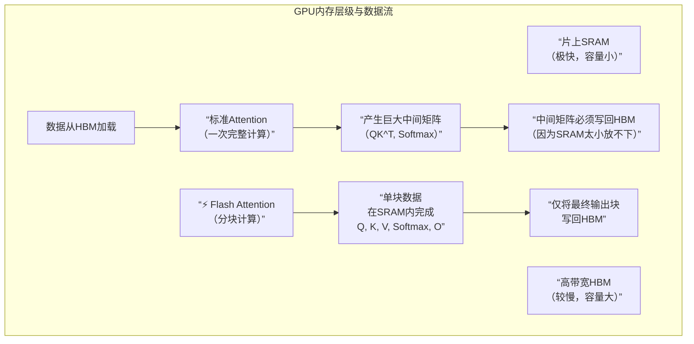

**名词解释**：
*   **HBM**：GPU的高带宽显存，就是我们比喻中的“工作台”，容量较大但相比SRAM仍慢。
*   **SRAM**：GPU片上缓存（类似CPU的L1/L2缓存），是我们比喻中“工人手边的小本子”，**速度极快但容量极小**。Flash Attention的魔法就在于将关键计算约束在SRAM内进行。
*   **中间矩阵**：即`QK^T`和`Softmax`矩阵，其大小与序列长度的平方成正比，是显存的主要杀手。

### 💎 总结与意义

简单来说，Flash Attention的核心贡献是：
**通过精妙的算法重构，将Attention计算“流片化”，让数据尽可能待在GPU最快（SRAM）的区域里反复计算，彻底避免了与慢速区域（HBM/内存）之间对海量中间结果的无效搬运。**

**带来的实际好处**：
1.  **更快**：训练和推理速度大幅提升。
2.  **更长**：因为显存占用大幅降低，现在能处理更长的文本序列（上下文长度）。
3.  **更省**：可以用更小的显卡跑起更大的模型，降低了研究和应用的门槛。

所以，Flash Attention不是让计算本身变快了，而是让它**“等待数据”的时间变少了**，是现代大模型能够发展至今的关键底层优化之一。

这是一个非常好的问题，直接触及了传统Attention效率低下的核心。答案是：**传统（标准）Attention计算的主要瓶颈确实发生在HBM上，但它并非“只”使用HBM，而是无法有效利用GPU中更快的SRAM缓存，导致整个计算过程被慢速的HBM读写所拖累。**

我们可以用硬件的层级结构来精确理解这一点：

### 🏗️ 从硬件层级看Attention计算

下图展示了GPU内存的层级结构以及Flash Attention带来的优化路径：

**关键在于这张图和流程**：
1.  **数据的必经之路**：所有数据（`Q`, `K`, `V`）最初都存放在**HBM**中。任何计算单元（如Tensor Core）想要处理它们，**都必须**先将数据从HBM加载到**SRAM或寄存器**中进行操作。所以，标准Attention**也用到了SRAM进行实际的矩阵运算**。
2.  **标准Attention的“阿喀琉斯之踵”**：问题在于，标准Attention的计算步骤会产生巨大的中间矩阵（`S = QK^T` 和 `P = Softmax(S)`）。**这些矩阵的大小与序列长度的平方成正比**。
    *   对于一个长度为4096的序列，`S`矩阵的大小约为 `4096×4096`，如果以FP16格式存储，就需要 **~32 MB** 的空间。
    *   GPU的**SRAM缓存通常只有几MB到几十MB**（例如A100的SRAM约20MB或40MB），**根本无法一次性容纳整个巨大的中间矩阵**。
3.  **被迫的往返搬运**：由于SRAM装不下，系统不得不将这些正在计算中的**中间矩阵写回HBM暂存**。而下一步计算（如计算 `P×V`）又需要把它们**从HBM重新读回SRAM**。
    *   **这就形成了上图中标准Attention的致命循环**：`HBM → SRAM (计算) → HBM (存储中间结果) → SRAM (再计算) → HBM`。
    *   整个过程中，最耗时的不是SRAM中的快速计算，而是**在慢速的HBM和快速的SRAM之间来回搬运这些海量的中间数据**。

### 💎 核心区别总结

| 特性 | 标准Attention | Flash Attention |
| :--- | :--- | :--- |
| **主战场** | **HBM**（被迫成为中间数据的“停车场”） | **SRAM**（作为核心计算的“流水线车间”） |
| **数据流动** | 频繁在HBM和SRAM之间**来回搬运**完整的中间矩阵。 | 将输入数据分块，**每块数据在SRAM内完成从输入到输出的全部计算**，中间结果不写回HBM。 |
| **IO访问** | **高**。对HBM的读写次数与序列长度成**平方**关系。 | **低**。对HBM的读写次数与序列长度成**线性**关系。 |
| **显存占用** | **高**。需要存储完整的 `QK^T` 和 `Softmax` 矩阵。 | **低**。无需存储完整的中间矩阵，峰值显存占用大幅下降。 |

所以，说标准Attention“使用HBM进行矩阵计算”不够准确，更准确的说法是：**标准Attention的计算过程被HBM的带宽和容量严重限制，大量的计算时间浪费在等待数据从HBM搬运到计算单元上，而不是计算本身。**

Flash Attention的精妙之处，就是通过算法重构，让整个注意力计算链适配进SRAM这个小而快的空间里，从而**避开了对HBM的频繁访问**，实现了速度和内存的双重优化。